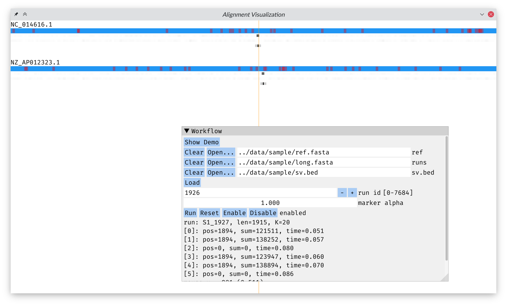

### 术语约定

* ref：指原串。
* sv：指变异后的串。
* SV：指某个变异。
* runs/run：指 sv 上截取出的子串。
* loc：指 run 定位到 ref 上的子串。

### 步骤

* `locate`：把 `long.fasta` 中的所有串定位到 ref 的某个区间上。
* `dump`：识别出 SV 的左右端点。
* `analyze`：匹配端点并判断 SV 类型。

### `locate`

$\mathrm O(nm)$ DP。

对 ref 建后缀自动机，从而能够从任意位置开始做 DP 匹配。这样的 DP 实际上和单源最短路等价，可以设计 A\* 策略来加速 DP。作为对比，普通 DP 实际上是多源最短路。对每个 run，每 20 个字符的子串，用上述 DP 在 ref 上定位（`fuzzy_locate`）。统计 ref 上覆盖频次，在覆盖最多的区域附近用普通 DP 找出准确的定位区间 loc（`local_align`）。

定位后，每个 run 报告准确率、loc/run 长度比和是否是互补反串。

### `dump`

$\mathrm O(nm)$ DP + $\mathrm O(m^2)$ 扫描线凸包枚举。

对每个 run，正反两个方向和 loc 做普通 DP，计算出 run 的每个前缀和 loc 的最优前缀匹配的长度，画成散点图。

`prefix_span` 和 `suffix_span` 负责找出疑似 SV 端点的位置。首先用 LIS 算法找出最长不降子序列后移除掉离群的点（`trim_outliers`），然后使用 $\mathrm O(m^2)$ 枚举求出将散点图划分成至多三个 stick 的最优方案（`decompose`/`french_stick_decompose`）。stick 是一段连续的点，在理想情况下它们应该接近共线。我们定义一个 stick 的代价是 stick 中所有点构成的凸包的面积的 0.45 次方。我们需要最小化所有 stick 的代价之和。`decompose` 中有一些启发式策略来判断最优划分成几段。此外会使用最小二乘法拟合第一段的斜率。如果斜率过小，则说明可能 run 的端点位于某个 SV 内部。此时会稍微调整左右端点重试 `prefix_span` 或 `suffix_span`。如果最后 `decompose` 分解出了至少两段，则说明第一段末尾的位置可能是某个 SV 的端点。

下面两张图是样例中 run “`S1_1144`” 覆盖 SV “`INV NC_014616.1 1584741 1585155`” 的散点图：

红色、绿色和蓝色的三段表示划分出的三个 stick。橙色表示离群的点。第一段的末尾的位置已经用黑色线段标出。

由 `prefix_span` 发现称为左端点，由 `suffix_span` 发现的称为右端点。

如果发现某个 run 内检测出了两个 SV 端点，则另外报告 SV 是 `INV` 的可能性。

### `analyze`

汇总 `dump` 生成的端点信息。

对于左端点 $l$ 和右端点 $r$：

* 如果在 run 上的两个端点附近的串能匹配上，则说明 $l$、$r$ 是 `DEL` 或 `DUP`（`probe_del_and_dup`）。
    * 如果 $l < r$ 则认为是 `DEL`，否则认为是 `DUP`。
* 如果 $l$ 和 $r$ 挨得很近，可以认为是 `INS`（`probe_ins`）。
* 如果 $l$ 和 $r$ 和某个 `dump` 报告的 `INV` 挨得很近，则可以认为是 `INV`（`probe_inv`）。

以上几种情况，如果认为有可能，则 $l$ 和 $r$ 之间连一条对应 SV 类型标注的无向边。最后得到一个二分图。

只考虑二分图中某种类型的边，每个连通块是一个 SV。将连通块左右分量的点分别收集起来做平均，就得到了最终的 SV 端点（`dump`/`dump_normal`）。

对于落单的点，使用普通 DP 检测其附近是否有 `DEL` 或 `DUP`。如果有则作为上一步的补充输出（`dump_extra_del_and_dup`）。

之后将所有端点按 200 的阈值进行合并。把所有距离在 50~1100 以内的左右端点认为是 SV 区间（`compact`）。如果两个 SV 区间长度差不多，则认为是 `TRA`（`dump_tra`）。落单的 SV 区间按 `INV` 输出（`dump_extra_inv`）。

### 其它

`locate` 和 `dump` 都支持多线程运行。

### 编译/运行方法

见 README。

### 输出

见：

* `build/sample.answer.txt`
* `sv.bed` → `build/final.answer.txt`

### 性能

配置：

* Linux 内核版本：5.11.22
* 系统类型：amd64
* 处理器：Intel® Core™ i5-8300H CPU @2.30GHz
* 主存：15.3GiB

运行样例约 30min，运行最终数据约 45min。
